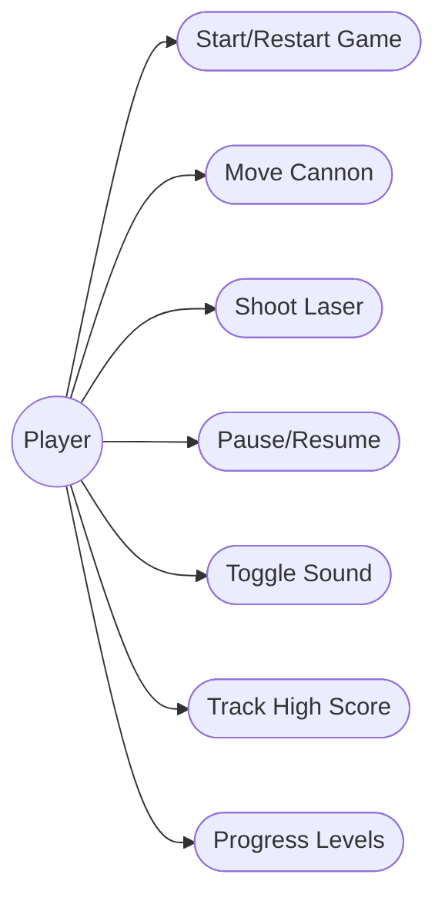
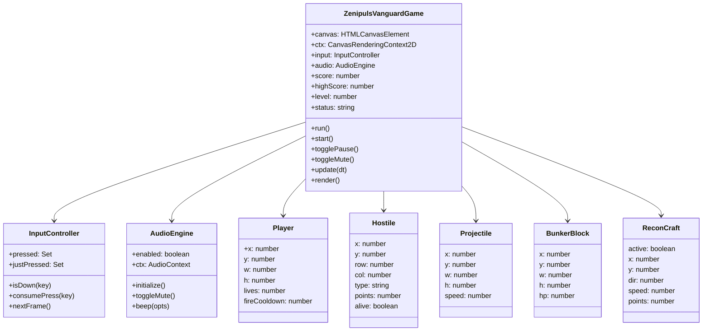
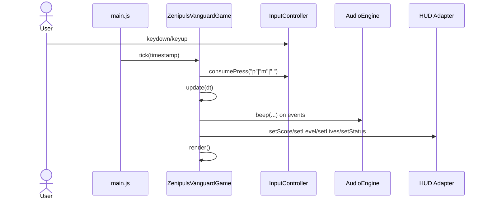
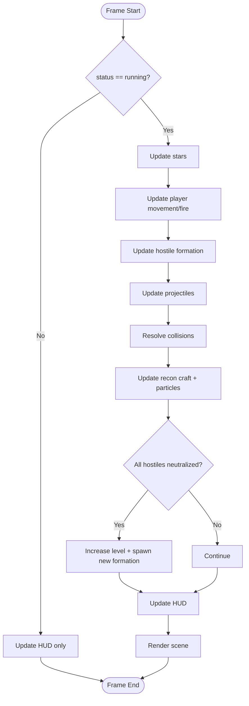
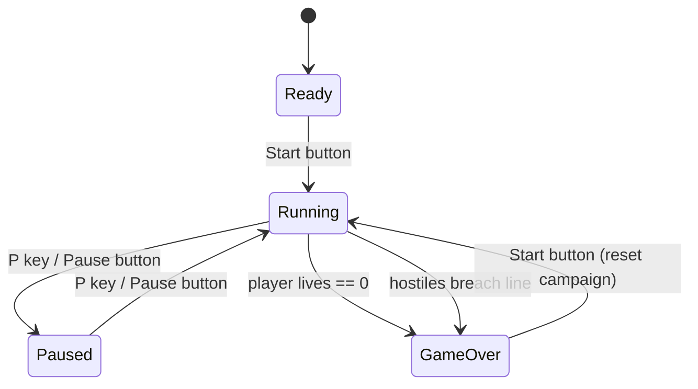
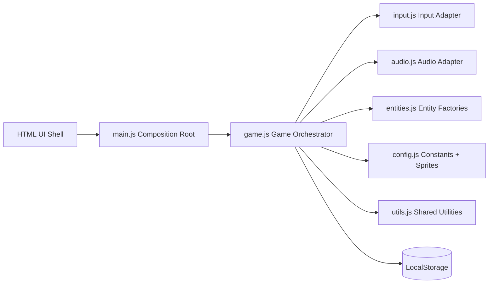
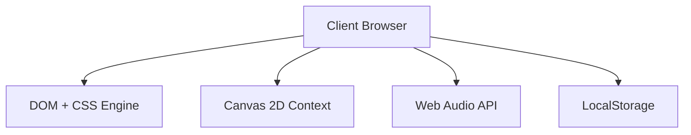
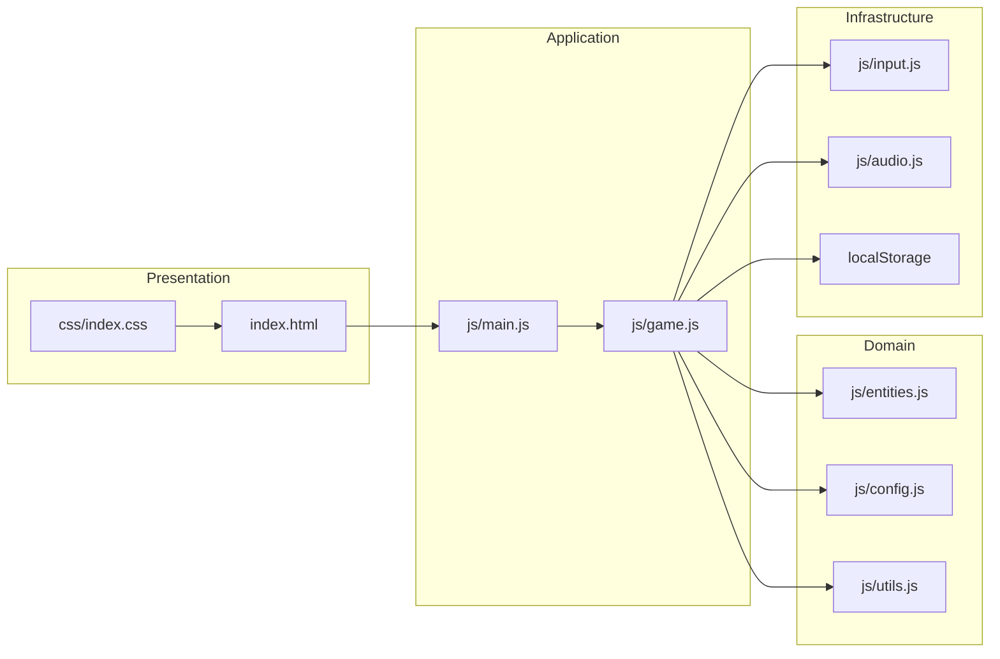

# Zenipuls Vanguard - Software Architecture

## 1. Architectural Intent

This project implements an original-style arcade fixed-shooter experience with modern browser engineering quality. The primary architecture goals are:

- Optics like a classic game loop and rule system.
- Keep deterministic, testable gameplay logic separated from rendering concerns.
- Ensure scalability for additional enemies, power-ups, and game modes.
- Deliver high aesthetic graphics with lightweight runtime cost.

The architecture follows a layered, componentized model with clear module boundaries:

- Presentation Layer: DOM HUD, control deck, game canvas, and full-stage-panel touch-control overlay.
- Application Layer: game orchestrator and state transitions.
- Domain Layer: entities, movement rules, collision/resolution, scoring.
- Infrastructure Layer: input event stream, audio synthesis, storage persistence.

## 2. Quality Attributes

### 2.1 Performance

- 60 FPS target using `requestAnimationFrame`.
- Fixed upper bound on delta-time (`dt <= 0.033`) to avoid tunneling and unstable jumps.
- Lightweight particle and sprite rendering with bounded object counts.

### 2.2 Maintainability

- Feature responsibilities split by module:
  - `config.js` defines balancing constants and sprite bitmaps.
  - `entities.js` creates domain object graphs.
  - `game.js` hosts orchestration and deterministic update pipeline.
  - `audio.js` wraps Web Audio with minimal API surface.
  - `input.js` normalizes keyboard state transitions.
- Shared helpers isolated in `utils.js`.

### 2.3 Usability

- Keyboard + button controls for accessibility.
- Status messaging for runtime state (`ready`, `running`, `paused`, `gameover`).
- Responsive layout retaining gameplay readability on mobile.

### 2.4 Fidelity to Arcade Style

- Pixel sprite rendering for player, hostile units, and recon craft.
- Formation marching with alternating animation frames.
- Descending wall pressure and bunker attrition.

## 3. Runtime Architecture

### 3.1 Main Runtime Components

- `index.html`: UI shell, semantic regions, HUD metrics, game canvas, and touch-control overlay canvas.
- `main.js`: composition root, binds UI adapters and control event hooks.
- `ZenipulsVanguardGame` (`game.js`): central runtime coordinator.
- `InputController` (`input.js`): key state and edge-triggered actions.
- `AudioEngine` (`audio.js`): synthesized SFX (beeps, ramps, pulses).
- Domain model factories (`entities.js`): player, hostiles, stars, bunkers.

### 3.2 Core Game State

`ZenipulsVanguardGame` state envelope:

- Session state: `score`, `highScore`, `level`, `status`.
- Player state: position, lives, fire cooldown.
- Enemy state: hostile set, movement direction/speed, animation frame.
- Projectile state: single player shot + N hostile shots.
- Environment state: stars, bunkers, particles, recon craft lifecycle, floating score popups.

### 3.3 Progressive Web App Runtime

- `manifest.webmanifest` defines the installable application identity, `./` start URL and scope, fullscreen display mode, landscape orientation, dark theme colors, and the local launcher icon.
- `main.js` registers `sw.js` with the `./` scope when the browser supports service workers.
- `sw.js` precaches the application shell: HTML, CSS, JavaScript modules, the local SVG icon, and locally hosted font files.
- Requests are served cache-first for cached resources. Successful same-origin network responses are added to the current cache for subsequent offline use; non-GET requests are left untouched.
- Service-worker activation removes older cache versions and claims existing clients. Increment `CACHE_NAME` when the shell cache contents or cache strategy changes.
- Installation requires a secure context: HTTPS in deployment or `localhost` during development. Direct `file://` loading cannot register the service worker or install the PWA.
- The installed app launches without browser chrome in fullscreen mode. The manifest requests landscape orientation, while responsive CSS remains responsible for fitting the game stage to the available display.
- Users install from the browser after opening the hosted game: Android and desktop Chromium expose **Install app** or **Add to Home screen** in the browser menu; iOS/iPadOS Safari exposes **Add to Home Screen** from the Share menu.

### 3.4 Update Pipeline per Frame

1. Capture user intent transitions (`consumePress`) for pause/mute/shoot.
2. Skip world simulation if not running.
3. Simulate stars and environmental movement.
4. Update player movement/fire gate.
5. Update hostile formation march, drop rules, and firing cadence.
6. Integrate projectile movement and resolve collisions.
7. Update recon craft spawn/movement lifecycle.
8. Update particle decay and cleanup.
9. Update floating score drift and fade.
10. Validate level progression and gameover thresholds.
11. Push metrics to UI adapter.
12. Render in painter order.

This explicit ordering prevents side effects from competing subsystems and keeps behavior deterministic at equal input sequences.

## 4. Data and Domain Model

### 4.1 Entity Types

- Player:
  - fields: `x, y, w, h, speed, fireCooldown, lives`
  - rules: horizontal constrained movement; one active player projectile.

- Hostile:
  - fields: `x, y, w, h, row, col, type, points, color, alive, isFalling, vy, rotationPhase, rotationAmplitude, rotationFrequency`
  - rules: formation movement controlled globally by group logic; oscillate ±20 degrees around center with 0.5 Hz frequency.
  - **Raider special**: when hit, enters falling state instead of immediate removal; continues horizontal movement while accelerating downward at 300 px/s²; remains visible; can be hit again for additional scoring while falling; removed only after exiting bottom of screen.
  - **Game over logic**: game ends only if non-falling hostile reaches player line; falling Raiders do not trigger game over.

- Projectile:
  - fields: `x, y, w, h, speed`
  - rules: owner-specific velocity direction; removed on hit or out-of-bounds.

- BunkerBlock:
  - fields: `x, y, w, h, hp`
  - rules: degrade with impacts until removed.

- ReconCraft:
  - fields: `active, x, y, w, h, dir, speed, points, baseY, sinePhase, sineAmplitude, sineFrequency`
  - rules: periodic spawn with crossing trajectory; oscillates vertically ±20 pixels around baseY with 0.5 Hz frequency while moving horizontally.

- Particle:
  - fields: `x, y, vx, vy, life, size, color`
  - rules: visual feedback only; decays over time.

- FloatingScore:
  - fields: `x, y, points, lifetime`
  - rules: spawned at collision location; drifts upward 40 px/s; fades to transparent over 1 second; removed when lifetime expires.
  - **Display**: bright yellow text with golden glow, shows "+{points}" format.

### 4.2 Collision Rules

Collision predicate uses AABB intersection:

$$
intersects(a,b) = a.x < b.x+b.w \land a.x+a.w > b.x \land a.y < b.y+b.h \land a.y+a.h > b.y
$$

Resolution policy:

- Player shot first-hit wins (hostile > recon craft > bunker block by iteration order).
- Hostile shot can hit bunker or player.
- Each hit triggers visual + audio feedback and potential state transition.
- **Raider destruction**: Raiders do not disappear on hit; instead, they enter `isFalling` state with initial `vy = 0`. Falling Raiders remain collidable and can be hit again for additional scoring.
- **Multi-hit scoring**: Players can score the same Raider multiple times by hitting it while it falls, encouraging continued engagement with high-value targets.

## 5. Rendering Architecture

### 5.1 Canvas Rendering Strategy

- Immediate mode canvas drawing each frame.
- Pixel sprites encoded as binary string matrices in `config.js`.
- `drawPixelSprite` converts bitmaps to scaled glowing blocks.
- Background uses layered gradients, starfield, grid scanlines, and frame border.

### 5.2 Visual Hierarchy (Painter Order)

1. Cosmic gradient + stars + scanline atmosphere.
2. Bunkers.
3. Hostiles and recon craft (including falling Raiders with rotation applied).
4. Player.
5. Shots and particles.
6. Floating score text with glow.
7. State overlays (ready/paused/gameover).

This ordering preserves legibility and classic arcade silhouette contrast while ensuring floating scores remain prominently visible above all game elements.

### 5.3 Pendulum Rotation and Oscillatory Motion

- **Hostile rotation**: All hostiles (Warden, Raider, Drone) execute a smooth pendulum rotation of ±20 degrees around their center sprite, driven by a 0.5 Hz sine wave. This creates a rhythmic swaying motion that reinforces arcade aesthetic.
- **ReconCraft oscillation**: ReconCraft bobs vertically ±20 pixels around a fixed center height (y=62) with 0.5 Hz frequency, while maintaining horizontal crossing motion. Phase resets on each spawn.
- **Canvas transform**: `drawPixelSprite()` uses canvas save/restore with translate/rotate to apply rotation around sprite center without distorting pixel alignment.

### 5.4 Enhanced Particle Explosion System

Explosion intensity scales with hostile row, creating hierarchy of visual feedback:

- **Warden (Row 0)**: 64 particles, color palette [yellow, golden yellow, orange, dark orange, red-orange, red], sizes 2–5 px, speeds 50–280 px/s — dramatic fire burst.
- **Raider (Rows 1–2)**: 42 particles, color palette [golden yellow, warm orange, orange, dark orange, red-orange], sizes 1.4–4 px, speeds 40–240 px/s — strong explosive hit.
- **Drone (Rows 3–4)**: 14 particles, original cyan/green colors (inherited from entity), sizes 1–3.2 px, speeds 26–180 px/s — subtle minimal effect.

Fire-themed color gradients (yellow → red) emphasize dramatic elimination of high-value targets. Falling Raiders do not spawn additional bursts beyond their initial hit.

### 5.5 Floating Score System

Floating score popups provide immediate visual feedback for player actions and scoring achievements:

- **Spawn trigger**: Triggered whenever a hostile is destroyed or ReconCraft is eliminated; spawned at entity center position.
- **Lifecycle**: Displays for exactly 1 second; fades from full opacity to transparent over this duration.
- **Rendering**: Bold 20px sans-serif yellow text (`rgba(255, 255, 150)`) displaying "+{points}" format.
- **Glow effect**: 20px golden-orange shadow blur (`rgba(255, 200, 0)`) around text; fades in sync with text opacity for cohesive effect.
- **Motion**: Drifts upward at constant 40 px/s velocity while fading; creates visual "floating away" effect as player receives reward feedback.
- **Multi-hit scoring**: Falling Raiders can spawn multiple floating scores (one per hit) as player continues to engage them mid-fall, reinforcing engagement with high-value targets.

## 6. Interaction and Input Architecture

`InputController` normalizes keyboard and stage-panel pointer input into held state plus queued movement and action intents. The game canvas renders the scene, while a separate stage-panel overlay canvas renders touch controls. The controller owns pointer tracking and cleanup; `ZenipulsVanguardGame` owns movement and cooldown-gated action consumption.

The complete event mapping, stage-panel touch geometry, overlay visibility, merge semantics, cancellation behavior, and public API are specified in the [Input Contract](input_contract.md).

## 7. Audio Architecture

- Lazy initialization of `AudioContext` to align with browser gesture policies.
- Single `beep` method provides programmable waveform envelopes.
- Runtime events map to short synthesized motifs:
  - player shot: upward frequency glide.
    - hostile shot: downward glide.
    - hostile step pulse.
  - explosion bursts and level-up accent.

## 8. Persistence Architecture

- `localStorage` key: `zenipuls_vanguard_high_score`.
- High score loaded at startup and saved only when surpassed.
- No gameplay-critical state is persisted to avoid stale corrupted resumes.

## 9. State Machine

- `ready`: pre-start attract state.
- `running`: full simulation active.
- `paused`: simulation halted, render + HUD continue.
- `gameover`: simulation stopped until restart.

Transitions are explicit and side-effect bounded.

## 10. Error Handling and Safety

- Audio gracefully disables if Web Audio API unavailable.
- Delta-time clamped to prevent simulation spikes after tab inactivity.
- Bunker block lists compacted after HP reaches zero.
- Canvas rendering operations avoid expensive allocations in hot loops.

## 11. Extensibility Strategy

Recommended extension points:

- Add new enemy archetypes by extending sprite/type metadata in `config.js`.
- Add power-ups by introducing a `powerups` collection and collision stage.
- Add wave scripts via level descriptors with movement/firing modifiers.
- Extend `InputController` with additional intent sources while preserving its normalized input API.

## 12. UML Suite (Mermaid)

### 12.1 UML Use Case Diagram

### 12.2 UML Class Diagram

### 12.3 UML Sequence Diagram (One Frame)

### 12.4 UML Activity Diagram (Gameplay Flow)

### 12.5 UML State Machine Diagram

### 12.6 UML Component Diagram

### 12.7 UML Deployment Diagram

### 12.8 UML Package Diagram

## 13. Validation Checklist

- Original arcade behavior: hostile march, drop, fire, bunker erosion, recon pass.
- Balanced progression: per-level formation speed gains and adaptive shot cadence.
- High aesthetics: layered gradients, retro scanline cues, neon HUD identity.
- Architectural depth: layered design + full UML suite + extension strategy.

## 14. Future Architectural Enhancements

- Introduce deterministic fixed-step accumulator for replay consistency.
- Add event bus for decoupled telemetry and achievements.
- Move sprite definitions to external JSON atlas for content pipeline scaling.
- Add test harness around collision and wave progression logic.
